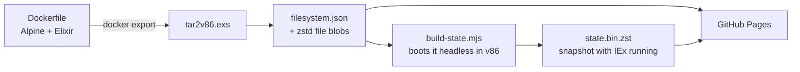

# IEx in the browser

**A real Elixir shell running in your browser tab.** Not a transpiler or a sandboxed subset: a
full Linux machine with Erlang/OTP and Elixir, emulated in WebAssembly and served as static files.

**[▶ Try it live](https://filipecabaco.github.io/iex_wasm/)**

[](https://github.com/filipecabaco/iex_wasm/actions/workflows/pages.yml)

```elixir
iex(1)> Enum.map(1..5, &(&1 * &1)) |> IO.inspect(label: System.version())
1.19.6: [1, 4, 9, 16, 25]
[1, 4, 9, 16, 25]
iex(2)>
```

> [!NOTE]
> This is an experiment. Expect it to be slow next to a native IEx: every instruction runs on
> an x86 CPU emulated in WebAssembly.

## What you get

- **Elixir 1.19 on Erlang/OTP 28**, on Alpine Linux 3.24 with kernel 6.18
- **Ready in under a second** once cached. The page restores a snapshot of a machine that has
  already booted, so you never wait for Linux to start
- **A real terminal**: xterm.js with colours, scrollback, copy/paste, and line wrapping that
  follows the window size
- **No backend.** About 100 MB of static files on GitHub Pages. Files load on demand, so a
  session only downloads what it touches

## How it works



1. **The guest** is an ordinary Docker image: i386 Alpine with Elixir, its kernel and an
   initramfs that can mount its root filesystem over 9p.
2. **`tar2v86.exs`** turns the exported image into [v86](https://github.com/copy/v86)'s 9p
   format. That's a JSON tree of the filesystem, plus every file stored once, named by its
   sha256 and compressed with zstd.
3. **`build-state.mjs`** boots that filesystem in v86 under Node, waits for the `iex(1)>`
   prompt, and saves the whole machine state: about 60 MB, or 14 MB with zstd.
4. **The browser** loads v86 and restores the snapshot. When IEx touches a file it hasn't read
   yet, v86 fetches that blob over HTTP and the guest kernel sees it as a disk read.

## Run it locally

You need [mise](https://mise.jdx.dev) and Docker.

```sh
mise install       # Erlang, Elixir and Node, pinned in mise.toml
mise run build     # build the guest, snapshot it, assemble dist/ (about a minute)
mise run serve     # http://localhost:8000
```

`mise run build` skips any stage whose inputs haven't changed:

| Task | What it does |
|------|--------------|
| `deps` | Installs v86 and xterm.js, pinned in `packages/web/package.json` |
| `site` | Copies the page, v86, xterm.js and the matching v86 BIOS into `dist/` |
| `rootfs` | Builds the guest image and converts it into `dist/system/` |
| `state` | Boots the guest headless and saves `dist/system/state.bin.zst` |

Every push to `main` runs the same build in GitHub Actions and deploys `dist/` to GitHub Pages.

## Make it yours

- **Add packages to the guest** by editing `packages/image-builder/Dockerfile` (`apk add …`),
  then run `mise run build`.
- **Change the RAM size or devices** in `packages/web/index.html` and
  `packages/image-builder/build-state.mjs` together. A snapshot only restores on the same machine
  it was taken on.

## Project layout

```
packages/
  image-builder/
    Dockerfile        the guest: Alpine + Elixir + 9p boot
    tar2v86.exs       rootfs tar → v86 9p filesystem (no dependencies, OTP 28+)
    build-state.mjs   boots the guest headless and snapshots it
  web/
    index.html        the page: v86 + xterm.js
    serve.exs         local static server
mise.toml             toolchain and build tasks
```

## Credits

Built on [v86](https://github.com/copy/v86) by Fabian Hemmer and contributors, which does all
the heavy lifting. The idea and early setup came from
[snaplet/postgres-wasm](https://github.com/snaplet/postgres-wasm) and
[iximiuz/docker-to-linux](https://github.com/iximiuz/docker-to-linux).
