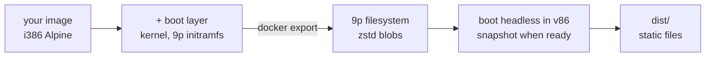

# snowglobe

**Package a Docker image into a website that runs it in the browser.** snowglobe boots your
image on real Linux inside [v86](https://github.com/copy/v86), an x86 emulator compiled to
WebAssembly, snapshots it once your app is ready, and writes a folder of static files. Visitors
get your program running in their tab in about a second, with no server behind it.

**[▶ Try the live demo: IEx in the browser](https://filipecabaco.github.io/iex_wasm/)**

[](https://github.com/filipecabaco/iex_wasm/actions/workflows/pages.yml)

```sh
snowglobe build ./my-app          # a directory with a Dockerfile, or any image reference
snowglobe serve dist              # preview at http://localhost:8000, then deploy dist/ anywhere
```

> [!NOTE]
> This is an experiment. Everything runs on an emulated 32-bit x86 CPU, so expect it to be much
> slower than native.

## What you need

- **Docker.** That's all the host needs: the snapshot step runs in a build container.
- **A 32-bit Alpine image** (`FROM i386/alpine`). v86 emulates a 32-bit x86 CPU, and Alpine is
  the distro snowglobe knows how to make bootable.

Build it from source with Go 1.27+ (`go build ./cmd/snowglobe`), or run it in place with
`go run ./cmd/snowglobe`.

## Your image, in a tab

Whatever the image runs (its `ENTRYPOINT`/`CMD`, with its `ENV` and `WORKDIR`) appears in a
terminal in the page. The live demo is this Dockerfile ([`examples/iex`](examples/iex/Dockerfile)):

```dockerfile
FROM i386/alpine:3.24.2
RUN apk add --no-cache elixir erlang28
ENV LANG=C.UTF-8
CMD ["iex"]
LABEL snowglobe.title="IEx in the browser" snowglobe.ready="iex(1)> "
```

| Flag | Label | Default |
|------|-------|---------|
| `--out DIR` | | `dist` |
| `--cmd CMD` | | the image's `ENTRYPOINT` + `CMD` |
| `--ready TEXT` | `snowglobe.ready` | snapshot once the terminal has been quiet for 5 s |
| `--title TEXT` | `snowglobe.title` | the source |
| `--memory MB` | `snowglobe.memory` | `512` |
| `--warm REGEX` | `snowglobe.warm` | only what the guest read while booting |

Labels let a Dockerfile describe itself; flags override them. `--cmd` swaps the program without
touching the image, and drops the image's `snowglobe.ready`, which belonged to its own command.

## How it works



1. **Boot layer.** snowglobe adds a kernel, an initramfs that mounts the root filesystem over 9p,
   OpenRC, and a terminal that runs your command, on top of your image.
2. **Filesystem.** `docker export` streams straight into snowglobe, which writes v86's format: a
   JSON tree plus one zstd-compressed blob per unique file, fetched by the browser on demand.
3. **Snapshot.** The guest boots headless in v86 until your app is ready, and the whole machine
   state is saved. Visitors restore it instead of booting Linux.
4. **Warm pack.** Every file the guest read while booting (plus anything matching `--warm`) is
   bundled into one `warm.pack` the page downloads in the background, so the first commands don't
   wait on one network round trip per file.

## Develop

```sh
mise install       # Go, pinned in mise.toml
mise run test
mise run build     # build examples/iex into dist/ (about a minute)
mise run serve
```

Pushing to `main` runs the tests and the same build in GitHub Actions, and deploys `dist/` to
GitHub Pages.

```
cmd/snowglobe/        the CLI
internal/rootfs/      tar stream → v86 9p filesystem + warm pack
internal/boot/        the boot layer added on top of your image
internal/tools/       build container: Node + v86 + xterm.js (pinned) and the snapshot script
internal/site/        the page
examples/iex/         the live demo's Dockerfile
```

## Credits

Built on [v86](https://github.com/copy/v86) by Fabian Hemmer and contributors, which does all
the heavy lifting. The idea and early setup came from
[snaplet/postgres-wasm](https://github.com/snaplet/postgres-wasm) and
[iximiuz/docker-to-linux](https://github.com/iximiuz/docker-to-linux).
