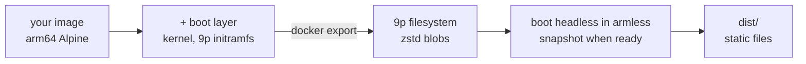

# snowglobe

**Package a Docker image into a website that runs it in the browser.** snowglobe boots your
image on real Linux inside [armless](https://github.com/filipecabaco/armless), a 64-bit ARM
machine compiled to WebAssembly, snapshots it once your app is ready, and writes a folder of
static files. Visitors
get your program running in their tab in about a second, with no server behind it.

**[▶ Try the demos](https://filipecabaco.github.io/snowglobe/)**: Supabase (its native stack and a small app on it), Elixir IEx, PostgreSQL, Elixir + Postgres, Python + Rich, TypeScript + Zod,
Go + Bubble Tea, Rust + clap, Java + Gson, and curl + jq (plain Alpine tools, online through your browser), each a small
project in [`examples/`](examples) running in the browser.

[](https://github.com/filipecabaco/snowglobe/actions/workflows/pages.yml)

```sh
snowglobe build ./my-app          # a directory with a Dockerfile, or any image reference
snowglobe serve dist              # preview at http://localhost:8000, then deploy dist/ anywhere
snowglobe pool sites              # several sites under one host share a single blob store
```

> [!NOTE]
> This is an experiment. Everything runs on an emulated 64-bit ARM CPU (translated to WebAssembly as
> it runs), so expect it to be slower than native. A site can have up to 8 CPUs (`--cpus`), which
> helps programs that use them (the Elixir demo runs CPU-bound tasks about 4× faster on 4); the
> demos use 2, to stay light on phones.

## What you need

- **Docker.** That's all the host needs: the snapshot step runs in a build container.
- **An arm64 Alpine image**: `FROM alpine` (multi-arch; snowglobe builds it for arm64) or
  `FROM arm64v8/alpine`. Alpine is the distro snowglobe knows how to make bootable. On an x86
  host, Docker needs QEMU's binfmt handlers to build arm64 images (Docker Desktop has them; on
  Linux: `docker run --privileged --rm tonistiigi/binfmt --install arm64`).

Install with Go 1.27+:

```sh
go install github.com/filipecabaco/snowglobe/cmd/snowglobe@latest
```

## Your image, in a tab

Whatever the image runs (its `ENTRYPOINT`/`CMD`, with its `ENV` and `WORKDIR`) appears in a
terminal in the page. The Python demo is this Dockerfile:

```dockerfile
FROM alpine:3.24.2
RUN apk add --no-cache python3
CMD ["python3"]
LABEL snowglobe.title="Python in the browser" \
      snowglobe.ready=">>> " \
      snowglobe.exercise='["import json, re, collections", "import asyncio; asyncio.run(asyncio.sleep(0))"]'
```

| Flag | Label | Default |
|------|-------|---------|
| `--out DIR` | | `dist` |
| `--cmd CMD` | | the image's `ENTRYPOINT` + `CMD` |
| `--ready TEXT` | `snowglobe.ready` | snapshot once the terminal has been quiet for 5 s |
| `--title TEXT` | `snowglobe.title` | the source |
| `--memory MB` | `snowglobe.memory` | `512` |
| `--exercise CMD` (repeatable) | `snowglobe.exercise` (JSON array) | none |
| `--warm REGEX` | `snowglobe.warm` | none |
| `--network fetch` | `snowglobe.network` | `none` |
| `--cpus N` (1–8) | `snowglobe.cpus` | `1` |

Labels let a Dockerfile describe itself; flags override them. `--cmd` swaps the program without
touching the image, and drops the image's `ready` and `exercise` labels, which belonged to its
own command.

With `--cpus 2` or more, each guest CPU runs in its own Web Worker on shared memory. Browsers only
allow that on a cross-origin isolated page, which a static host can't declare, so the site ships a
small service worker that adds the headers and reloads the page once on the first visit.

## Networking

Guests have no network unless you ask for it. With `--network fetch` (or
`LABEL snowglobe.network="fetch"`), the guest gets a virtio NIC and DHCP, and every request it
makes leaves as the page's own browser request. There is still no server. The guest's connections
to ports 80 and 443 end inside the machine, in armless's web relay:

- **HTTP** (port 80): each request becomes a `fetch()`.
- **HTTPS** (port 443) is terminated in the machine by a small TLS 1.3 server. It presents a
  certificate for the requested host, signed by a CA made fresh for each build, and the request
  inside is replayed with `fetch("https://…")`. The guest trusts that CA (the system bundle, plus
  `SSL_CERT_FILE`, `REQUESTS_CA_BUNDLE`, `NODE_EXTRA_CA_CERTS` and Java's `cacerts`). Nothing else
  should, since its key ships with the site.
- **WebSockets** (`wss://` and `ws://`): the guest's upgrade request opens a browser `WebSocket` to
  the same URL, and messages pass through both ways.

```console
/ # curl -sS https://api.github.com/zen
Approachable is better than simple.
/ # wscat -c wss://echo.websocket.org
Connected (press CTRL+C to quit)
> hello from wscat in a browser tab
< hello from wscat in a browser tab
```

The browser's rules still apply: HTTP(S) only reaches servers that allow CORS (example.com doesn't,
so the guest gets a 502 that says so), raw TCP and UDP go nowhere, and TLS is 1.3 with
X25519/P-256 and AES-128-GCM, which every current client offers. The TypeScript demo uses all of
it: Zod validating a live GitHub API response, and a WebSocket echo.

## Install it as an app

`snowglobe pwa dist/python` makes a built site a Progressive Web App: a manifest and icons, and a
service worker that caches the page, the machine and every file the run fetched, so it installs
to a home screen or dock and keeps working offline once it has run. Chromium shows an
**Install app** button in the status strip; on iOS, use Share → Add to Home Screen. A new build
gets a new cache. Run it after `snowglobe pool`; every demo on the live site is installable.

## Keep your workspace

Every newly built run remembers your work locally. The save bar always shows the **save
location**, **last-save time**, **current activity**, and **Save now**. **Save / restore** opens
an overlay without shrinking the terminal. Saves include the whole emulated machine—RAM,
processes and guest-written files—plus the terminal replay. This preserves TypeScript REPL
variables as well as Supabase's database and running services. No checkpoint is sent to a server.

The menu offers three clearly separated methods:

- **Browser — automatic** is the default: no setup, just Save now. Saves stay in this browser.
- **Backup file** lets you choose a filename and download or restore a `.snowglobe` file.
  This is an extra portable copy, not a change of automatic-save location. Autosave never updates
  a downloaded backup file. The browser handles the actual download and any existing filename.
  Restored backups are validated and become separate workspaces rather than overwriting existing
  ones. Backups may contain passwords, tokens, database contents and other guest memory; they are
  not encrypted. Keep them private and restore only files you trust.
- **Folder — automatic** is available on browsers with `showDirectoryPicker()` (principally
  desktop Chrome/Edge), and greyed out otherwise. Choose a folder; the save bar shows its name
  and dedicated `snowglobe-…` subdirectory. Browsers do not expose the full OS path. Two alternating
  files retain the previous valid save if a write fails or the newest file is corrupt. This is
  **session-bundle storage**, not a live guest filesystem mount. Reopening may require **Reconnect
  folder** permission. Switching storage copies current work and keeps old saves. A failed folder
  mount never silently switches to browser storage; choosing Browser offers an explicit switch.

Autosave defaults to **1 minute** while the page is visible. Its menu control also offers
**5 minutes**, **15 minutes**, and **Off — Save now only**; the preference survives refreshes and
storage changes. Expensive captures lengthen the interval. During capture, an overlay and status
say **Terminal briefly paused** and prevent input. The guest then resumes, the overlay disappears,
and compression/writing display **You can keep working. Keep this tab open until finished.**
The busy indicator remains until the checkpoint is committed (or an error is reported).

Refresh resumes the **last completed save**, not necessarily the latest changes. There is no
reliable unload-time save. Before leaving important work, use the visible **Save now** button
and wait for completion. **Unsaved changes** reflects observed input/terminal activity; it is a
conservative indicator, not proof that background processes haven't changed machine state. New
activity during compression/writing remains marked as unsaved after that checkpoint commits.

**Saved workspaces** groups opening previous saves, **Start fresh…**, named workspace creation,
and explicit deletion. Selecting a workspace does not open it until **Open selected workspace…**
is pressed and confirmed. Starting fresh retains previous saves; only **Delete this saved
workspace…** removes one. **Recovery** separately offers a reload that preserves saved work.
Firefox/Safari can use browser storage and backup download/restore.

Browser storage survives ordinary refreshes but is subject to quota, site-data clearing and
possible eviction. The page requests persistent storage when supported; the browser can refuse.
Checkpoint-write failures are shown, never reported as successful saves. A second tab on the
same demo opens a temporary run rather than competing for the saved sessions; it can export a
backup. Web Locks are required for automatic saving. Folder locking is local to this origin and
browser profile: do not write the same session folder concurrently from different browsers.

Checkpoints are tied to the exact base snapshot, filesystem, runtime and machine configuration.
After an incompatible rebuild, older sessions are **kept for export**, not silently restored or
replaced. Backups do not include the runtime or all original filesystem blobs: retain the
original built site and its blob store if you need to restore those sessions later. This is
checkpoint persistence, not a continuously durable Postgres volume or a database backup service.
External HTTP/WebSocket connections may need reconnecting after restore. Capturing large guests
uses additional memory and can briefly freeze the UI, especially on mobile devices.

## Share a run as a post

Every demo has an X player card at `card/<demo>/` (e.g.
[filipecabaco.github.io/snowglobe/card/elixir/](https://filipecabaco.github.io/snowglobe/card/elixir/)):
shared on X, the post itself boots the run in a 480×480 frame, and the link opens the demo page.
`elixir assets/cards.exs` writes the card pages and poster sources from `assets/cards.json`, where
each poster's lines are real output from that run; capture each poster at 480×480 into
`site/card/<demo>/poster.png`. X caches cards for about a week, so re-share with a new query string
after changing one.

## Running a site headlessly

A built site also runs without a browser, in a sandboxed container: the same snapshot, restored
by armless natively (`snowglobe-vm`, in Rust), with its app console on your terminal. The guest is
an emulated machine with no access to the host, and the container around it runs unprivileged,
read-only, memory-capped and offline unless the site was built with `--network fetch`.

With a network, the guest goes out the way your machine does. The same web relay makes its HTTP(S)
and WebSocket requests, other TCP connections are made for it, and private addresses are off
limits. If `HTTPS_PROXY`, `HTTP_PROXY` or `NO_PROXY` are set, they go to the container, and so does
`SSL_CERT_FILE`. That covers sandboxes whose only way out is a TLS-intercepting proxy.

```console
$ snowglobe run dist/elixir                 # a session; ctrl-] quits
$ printf 'Enum.sum(1..100)\n' | snowglobe run dist/elixir
5050

$ snowglobe run dist/elixir --name pg --detach
$ snowglobe exec pg 'sql "CREATE TABLE notes (body text)"'
$ snowglobe exec pg "sql \"INSERT INTO notes VALUES ('from snowglobe exec')\""
$ snowglobe exec pg 'sql "SELECT * FROM notes"'
body
───────────────────
from snowglobe exec
1 row(s)
$ snowglobe attach pg                       # join it; ctrl-] detaches, it keeps running
$ snowglobe ps
$ snowglobe stop pg
```

A site doesn't have to be local. `snowglobe run` also takes a deployed site's URL (any static
host or CDN: it mirrors what a run needs into a cache, the warm pack in one request) or a tarball,
local or by URL, made with `snowglobe pack`. Downloads happen on the host and are revalidated
(ETag or Last-Modified), so the second run starts from the cache and the sandbox stays offline:

```console
$ snowglobe run https://filipecabaco.github.io/snowglobe/python/
$ snowglobe pack dist/elixir -o elixir.tar.gz      # one self-contained file, pooled blobs included
$ snowglobe run https://cdn.example.com/elixir.tar.gz
```

A site built with `--network fetch` can also serve: `-p HOST:GUEST` forwards a port on your machine
to a port in the guest, through the same virtual network its own requests use. Host ports bind to
127.0.0.1 unless you give an address (`-p 0.0.0.0:8080:4000`):

```console
$ snowglobe run dist/typescript --name web --detach -p 4000:4000
$ snowglobe exec web 'const http = await import("node:http"); http.createServer((req, res) => res.end("hello\n")).listen(4000)'
$ curl http://127.0.0.1:4000/
hello
```

Piped stdin is typed in one line at a time, each waiting until the app goes quiet. `exec` prints
only what the command printed (no echo, no prompt) and plain text when its output isn't a
terminal, which suits scripts and agents. Each instance starts fresh from the snapshot.

### Supabase, and packages from Alpine

Two examples go further:

- **[`supabase`](examples/supabase)** (on the demo site) runs the Supabase CLI's native local stack
  (Postgres, PostgREST and Auth as plain processes, no Docker) inside the guest, on 2 CPUs, with
  `notes`, a small app on it (90 lines of TypeScript): users sign up through Auth, notes are
  stored and searched through the Data API, and row level security keeps each user's notes their
  own. It runs on the Bun inside the Supabase CLI (`BUN_BE_BUN=1`), so the image carries no Node,
  and a command takes well under a second. The stack's services are glibc programs, so the image
  carries Debian's glibc next to Alpine's musl, and Postgres extensions the demo never loads
  (Wrappers, PostGIS, PL/Perl, PGroonga) are left out.
- **[`apk`](examples/apk)** installs Alpine packages into the running machine (`apk add figlet`).
  Alpine's mirrors don't allow CORS, so this only works under `snowglobe run`, where the guest's
  requests go out from the host; CI builds and checks it, but it isn't on the demo site.

```console
$ snowglobe build examples/supabase --out dist/supabase
$ snowglobe run dist/supabase
supa:~/app$ notes signup ada@example.com lovelace-1815
signed in as ada@example.com (0941bc18)
supa:~/app$ notes add first program, for the analytical engine
#1 added
supa:~/app$ notes signup grace@example.com hopper-1906 && notes ls
signed in as grace@example.com (66973d17)
grace@example.com: 0 note(s)
```

## Development checks

Run `go test ./...` and `node --test internal/site/sessions.test.cjs` (Node 22+; no npm packages
needed), or `mise run test`. To exercise real IndexedDB transactions, Web Locks and filesystem
writable streams, serve the repository on localhost and open
`internal/site/sessions.browser.html` in a visible tab; its results are displayed on the page.
The automatic-saving check requires the tab to remain visible, just like the demos. Full session
restore should also be checked against a built demo, since storage tests do not verify the VM.

## The warm cache

The guest's files are fetched on demand: the first time the guest reads a file, it waits on one
HTTP request for it. To hide that, every site preloads a `warm.pack` in the background, and
snowglobe fills it by **measuring**, not guessing:

- **Boot reads:** every file the guest read while booting to the ready point. The snapshot is
  taken with the page cache dropped, so the app reads these again after a restore.
- **Exercise reads:** after the snapshot is saved, snowglobe types each `--exercise` command into
  the app and records what it reads. The guest is then exactly where a visitor's tab starts, so
  these are the files a visitor's first commands would otherwise wait for.
- **Pattern:** anything matching `--warm`, for files no exercise touches.

Each build prints a breakdown and writes `warm-report.json` (by phase and directory, in download
bytes). What the demos show:

| Demo | Boot | First commands | Never read | What dominates |
|------|-----:|---------------:|-----------:|----------------|
| Elixir + Postgres | 23.8 MB | 0 | 30.6 MB | a release in embedded mode loads every module at startup, and Postgres reads its catalog as it starts |
| Python + Rich | 8.3 MB | 0.1 MB | 43.5 MB | the startup file imports Rich, so its modules are boot reads |
| TypeScript + Zod | 25.6 MB | 3.8 MB | 29.1 MB | the `node` binary, then tsx/esbuild and Zod's modules on first use |
| Go + Bubble Tea | 5.4 MB | 0 | 25.1 MB | one static binary, read at boot |
| Rust + clap | 4.0 MB | 0.4 MB | 25.1 MB | `jtab` is read on first use; the shell is all that boots |
| Java + Gson | 48.2 MB | 0 | 115.4 MB | the JDK's `lib/modules` image, opened at boot |
| curl + jq | 4.1 MB | 2.3 MB | 24.9 MB | `curl`, its TLS and `jq` load on the first request |

Whatever a program loads lazily needs exercises to warm well (TypeScript's compile path, Zod,
first-use tools); whatever it loads up front (a release in embedded mode, a startup file's imports,
a single static binary, Java's module image) is captured by boot reads alone.

## Several sites, one host

`snowglobe pool <dir>` lets every site under a directory share one blob store. Blobs are named by
content hash, so sites built on the same base (kernel, Alpine, the boot layer) share many: the six
language demos go from 715 MB to 544 MB, and a visitor's second demo reuses what their browser cached.

## How it works



1. **Boot layer.** snowglobe adds a kernel, an initramfs that mounts the root filesystem over 9p,
   OpenRC, and a terminal that runs your command, on top of your image.
2. **Filesystem.** `docker export` streams straight into snowglobe, which writes a 9p filesystem
   (v86's format, which armless reads): a JSON tree plus one zstd-compressed blob per unique file,
   fetched by the browser on demand.
3. **Snapshot.** The guest boots headless in armless (natively, in the build container) until your
   app is ready, and the whole machine state is saved. Visitors restore it instead of booting Linux.
4. **Warm pack.** The files the guest read while booting and while being exercised are bundled
   into one `warm.pack` the page downloads in the background (see above).

## Develop

```sh
mise install       # Go, pinned in mise.toml
mise run test
mise run build     # build all ten demos into dist/ (a few minutes)
mise run serve
```

Pushing to `main` runs the tests and the same build in GitHub Actions, and deploys `dist/` to
GitHub Pages.

```
cmd/snowglobe/        the CLI
internal/rootfs/      tar stream → 9p filesystem + warm pack
internal/boot/        the boot layer added on top of your image
internal/tools/       build container: snowglobe-vm (runtime/, Rust on armless) + armless.js and
                      xterm.js (pinned)
internal/site/        the page
internal/pool/        shared blob store for several sites
examples/             one Dockerfile per demo language
site/                 the demo index page
```

## Credits

The machine is [armless](https://github.com/filipecabaco/armless), which started as a fork of
[v86](https://github.com/copy/v86) by Fabian Hemmer and contributors. snowglobe was built on v86
first, and its 9p filesystem format is v86's. The idea and early setup came from
[snaplet/postgres-wasm](https://github.com/snaplet/postgres-wasm) and
[iximiuz/docker-to-linux](https://github.com/iximiuz/docker-to-linux).

For agents, the site serves a plain-text summary of the CLI at
[filipecabaco.github.io/snowglobe/llms.txt](https://filipecabaco.github.io/snowglobe/llms.txt).
