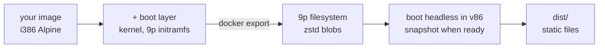

# snowglobe

**Package a Docker image into a website that runs it in the browser.** snowglobe boots your
image on real Linux inside [v86](https://github.com/copy/v86), an x86 emulator compiled to
WebAssembly, snapshots it once your app is ready, and writes a folder of static files. Visitors
get your program running in their tab in about a second, with no server behind it.

**[▶ Try the demos](https://filipecabaco.github.io/snowglobe/)**: Elixir + SQLite, Python + Rich, TypeScript + Zod,
Go + Bubble Tea, Rust + clap and Java + Gson, each a small project in [`examples/`](examples) running in the browser.

[](https://github.com/filipecabaco/snowglobe/actions/workflows/pages.yml)

```sh
snowglobe build ./my-app          # a directory with a Dockerfile, or any image reference
snowglobe serve dist              # preview at http://localhost:8000, then deploy dist/ anywhere
snowglobe pool sites              # several sites under one host share a single blob store
```

> [!NOTE]
> This is an experiment. Everything runs on an emulated 32-bit x86 CPU, so expect it to be much
> slower than native.

## What you need

- **Docker.** That's all the host needs: the snapshot step runs in a build container.
- **A 32-bit Alpine image** (`FROM i386/alpine`). v86 emulates a 32-bit x86 CPU, and Alpine is
  the distro snowglobe knows how to make bootable.

Install with Go 1.27+:

```sh
go install github.com/filipecabaco/snowglobe/cmd/snowglobe@latest
```

## Your image, in a tab

Whatever the image runs (its `ENTRYPOINT`/`CMD`, with its `ENV` and `WORKDIR`) appears in a
terminal in the page. The Python demo is this Dockerfile:

```dockerfile
FROM i386/alpine:3.24.2
RUN apk add --no-cache python3
CMD ["python3"]
LABEL snowglobe.title="Python in the browser" \
      snowglobe.ready=">>> " \
      snowglobe.exercise='["import json, re, collections", "import asyncio; asyncio.run(asyncio.sleep(0))"]'
```

| Flag | Label | Default |
|------|-------|---------|
| `--out DIR` | | `dist` |
| `--cmd CMD` | | the image's `ENTRYPOINT` + `CMD` |
| `--ready TEXT` | `snowglobe.ready` | snapshot once the terminal has been quiet for 5 s |
| `--title TEXT` | `snowglobe.title` | the source |
| `--memory MB` | `snowglobe.memory` | `512` |
| `--exercise CMD` (repeatable) | `snowglobe.exercise` (JSON array) | none |
| `--warm REGEX` | `snowglobe.warm` | none |
| `--network fetch` | `snowglobe.network` | `none` |

Labels let a Dockerfile describe itself; flags override them. `--cmd` swaps the program without
touching the image, and drops the image's `ready` and `exercise` labels, which belonged to its
own command.

## Networking

Guests have no network unless you ask for it. With `--network fetch` (or
`LABEL snowglobe.network="fetch"`), the guest gets a virtio NIC and DHCP, and every request it
makes leaves as the page's own browser request. There is still no server:

- **HTTP** (port 80) goes through v86's fetch backend: each request becomes a `fetch()`.
- **HTTPS** (port 443) is terminated in the page. `https-bridge.js` runs a small TLS 1.3 server on
  WebCrypto, presents a certificate for the requested host signed by a CA made fresh for each
  build, and replays the decrypted request with `fetch("https://…")`. The guest trusts that CA (the
  system bundle, plus `SSL_CERT_FILE`, `REQUESTS_CA_BUNDLE`, `NODE_EXTRA_CA_CERTS` and Java's
  `cacerts`); nothing else should, since its key ships with the site.
- **WebSockets** (`wss://` and `ws://`): the guest's upgrade request opens a browser `WebSocket` to
  the same URL, and frames are passed through both ways.

```console
/ # curl -sS https://api.github.com/zen
Approachable is better than simple.
/ # wscat -c wss://echo.websocket.org
Connected (press CTRL+C to quit)
> hello from wscat in a browser tab
< hello from wscat in a browser tab
```

The browser's rules still apply: HTTP(S) only reaches servers that allow CORS (example.com doesn't,
so the guest gets a 502 that says so), raw TCP and UDP go nowhere, and TLS is 1.3 with
X25519/P-256 and AES-128-GCM, which every current client offers. The TypeScript demo uses all of
it: Zod validating a live GitHub API response, and a WebSocket echo.

## The warm cache

The guest's files are fetched on demand: the first time the guest reads a file, it waits on one
HTTP request for it. To hide that, every site preloads a `warm.pack` in the background, and
snowglobe fills it by **measuring**, not guessing:

- **Boot reads:** every file the guest read while booting to the ready point. The snapshot is
  taken with the page cache dropped, so the app reads these again after a restore.
- **Exercise reads:** after the snapshot is saved, snowglobe types each `--exercise` command into
  the app and records what it reads. The guest is then exactly where a visitor's tab starts, so
  these are the files a visitor's first commands would otherwise wait for.
- **Pattern:** anything matching `--warm`, for files no exercise touches.

Each build prints a breakdown and writes `warm-report.json` (by phase and directory, in download
bytes). What the six demos show:

| Demo | Boot | First commands | Never read | What dominates |
|------|-----:|---------------:|-----------:|----------------|
| Elixir + SQLite | 13.8 MB | 0 | 19.7 MB | a release boots in embedded mode: every module loads at startup |
| Python + Rich | 8.5 MB | 0.1 MB | 36.9 MB | the startup file imports Rich, so its modules are boot reads |
| TypeScript + Zod | 25.8 MB | 4.1 MB | 22.2 MB | the `node` binary, then tsx/esbuild and Zod's modules on first use |
| Go + Bubble Tea | 5.4 MB | 0 | 18.1 MB | one static binary, read at boot |
| Rust + clap | 4.0 MB | 0.5 MB | 18.1 MB | `jtab` is read on first use; the shell is all that boots |
| Java + Gson | 39.2 MB | 0 | 91.1 MB | the JDK's 30 MB `lib/modules` image, opened at boot |

Whatever a program loads lazily needs exercises to warm well (TypeScript's compile path, Zod,
first-use tools); whatever it loads up front (a release in embedded mode, a startup file's imports,
a single static binary, Java's module image) is captured by boot reads alone.

## Several sites, one host

`snowglobe pool <dir>` lets every site under a directory share one blob store. Blobs are named by
content hash, so sites built on the same base (kernel, Alpine, the boot layer) share many: the six
demos go from 715 MB to 544 MB, and a visitor's second demo reuses what their browser cached.

## How it works



1. **Boot layer.** snowglobe adds a kernel, an initramfs that mounts the root filesystem over 9p,
   OpenRC, and a terminal that runs your command, on top of your image.
2. **Filesystem.** `docker export` streams straight into snowglobe, which writes v86's format: a
   JSON tree plus one zstd-compressed blob per unique file, fetched by the browser on demand.
3. **Snapshot.** The guest boots headless in v86 until your app is ready, and the whole machine
   state is saved. Visitors restore it instead of booting Linux.
4. **Warm pack.** The files the guest read while booting and while being exercised are bundled
   into one `warm.pack` the page downloads in the background (see above).

## Develop

```sh
mise install       # Go, pinned in mise.toml
mise run test
mise run build     # build all six examples into dist/ (a few minutes)
mise run serve
```

Pushing to `main` runs the tests and the same build in GitHub Actions, and deploys `dist/` to
GitHub Pages.

```
cmd/snowglobe/        the CLI
internal/rootfs/      tar stream → v86 9p filesystem + warm pack
internal/boot/        the boot layer added on top of your image
internal/tools/       build container: Node + v86 + xterm.js (pinned) and the snapshot script
internal/site/        the page
internal/pool/        shared blob store for several sites
examples/             one Dockerfile per demo language
site/                 the demo index page
```

## Credits

Built on [v86](https://github.com/copy/v86) by Fabian Hemmer and contributors, which does all
the heavy lifting. The idea and early setup came from
[snaplet/postgres-wasm](https://github.com/snaplet/postgres-wasm) and
[iximiuz/docker-to-linux](https://github.com/iximiuz/docker-to-linux).
