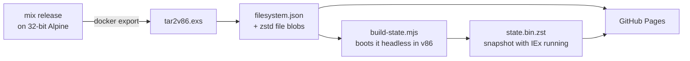

# IEx in the browser

**A real Elixir shell running in your browser tab.** Not a transpiler or a sandboxed subset: a
full Linux machine with Erlang/OTP and Elixir, emulated in WebAssembly and served as static files.

**[▶ Try it live](https://filipecabaco.github.io/iex_wasm/)**

[](https://github.com/filipecabaco/iex_wasm/actions/workflows/pages.yml)

```elixir
iex(1)> Enum.map(1..5, &(&1 * &1)) |> IO.inspect(label: System.version())
1.19.6: [1, 4, 9, 16, 25]
[1, 4, 9, 16, 25]
iex(2)>
```

> [!NOTE]
> This is an experiment. Expect it to be slow next to a native IEx: every instruction runs on
> an x86 CPU emulated in WebAssembly.

## What you get

- **A real Elixir release**: Elixir 1.19 on Erlang/OTP 28, on Alpine Linux 3.24 with kernel 6.18
- **Ready in under a second** once cached. The page restores a snapshot of a machine that has
  already booted, so you never wait for Linux to start
- **A real terminal**: xterm.js with colours, scrollback, copy/paste, and line wrapping that
  follows the window size
- **No backend.** About 80 MB of static files on GitHub Pages. Files load on demand, so a
  session only downloads what it touches

## How it works



1. **The guest** is an ordinary Docker image: a `mix release` built on 32-bit Alpine, plus a
   kernel and an initramfs that can mount the root filesystem over 9p.
2. **`tar2v86.exs`** turns the exported image into [v86](https://github.com/copy/v86)'s 9p
   format. That's a JSON tree of the filesystem, plus every file stored once, named by its
   sha256 and compressed with zstd.
3. **`build-state.mjs`** boots that filesystem in v86 under Node, waits for the `iex(1)>`
   prompt, and saves the whole machine state: about 75 MB, or 16 MB with zstd.
4. **The browser** loads v86 and restores the snapshot. When IEx touches a file it hasn't read
   yet, v86 fetches that blob over HTTP and the guest kernel sees it as a disk read.
5. **The warm pack** avoids most of those fetches. Once the prompt is up, the page downloads
   `warm.pack` in the background: one request carrying the code nearly every session touches
   (Elixir, IEx, stdlib, kernel, crypto and the libraries they link). Commands like `h`, `Task`
   or `:crypto` then load from memory instead of waiting on one network round trip per file.

## Run it locally

You need [mise](https://mise.jdx.dev) and Docker.

```sh
mise install       # Erlang and Elixir, pinned in mise.toml
mise run build     # build examples/playground into dist/ (about a minute)
mise run serve     # http://localhost:8000
```

Every push to `main` runs the same build in GitHub Actions and deploys `dist/` to GitHub Pages.

## Ship your own Elixir app

Everything here is packaged as **[BeamBox](packages/beam_box)**, a Mix task you can add to any
project:

```elixir
{:beam_box, path: "...", only: :dev, runtime: false}
```

```sh
mix beam_box.build     # your release, booted and snapshotted, as a static site in dist/
mix beam_box.serve
```

It builds `MIX_ENV=prod mix release` on 32-bit Alpine inside Docker, adds a kernel and 9p boot
layer, converts it to v86's format, and snapshots it with `bin/<release> start_iex` running.
Only Docker is needed on the host. See the [BeamBox README](packages/beam_box/README.md) for
options, such as `--cmd` to start something other than IEx.

The live demo is [`examples/playground`](examples/playground), a few lines of Elixir plus
`beam_box: [title: "IEx in the browser"]` in its `mix.exs`.

## Project layout

```
examples/playground/      the app behind the live demo
packages/beam_box/        the Mix package
  lib/                    mix beam_box.build / beam_box.serve
  priv/release.Dockerfile.eex   release build on 32-bit Alpine
  priv/boot.Dockerfile    kernel, 9p boot and terminal, added on top of the release
  priv/tools/             build container: tar2v86.exs, build-state.mjs, v86 + xterm.js pins
  priv/web/               the page
mise.toml                 toolchain and tasks
```

## Credits

Built on [v86](https://github.com/copy/v86) by Fabian Hemmer and contributors, which does all
the heavy lifting. The idea and early setup came from
[snaplet/postgres-wasm](https://github.com/snaplet/postgres-wasm) and
[iximiuz/docker-to-linux](https://github.com/iximiuz/docker-to-linux).
