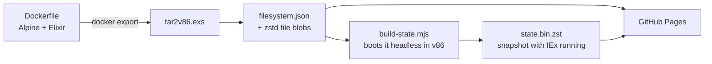

# IEx in the browser

**A real Elixir shell running in your browser tab.** Not a transpiler or a sandboxed subset: a
full Linux machine with Erlang/OTP and Elixir, emulated in WebAssembly and served as static files.

**[▶ Try it live](https://filipecabaco.github.io/iex_wasm/)**

[](https://github.com/filipecabaco/iex_wasm/actions/workflows/pages.yml)

```elixir
iex(1)> Enum.map(1..5, &(&1 * &1)) |> IO.inspect(label: System.version())
1.19.6: [1, 4, 9, 16, 25]
[1, 4, 9, 16, 25]
iex(2)>
```

> [!NOTE]
> This is an experiment. Expect it to be slow next to a native IEx: every instruction runs on
> an x86 CPU emulated in WebAssembly.

## What you get

- **Elixir 1.19 on Erlang/OTP 28**, on Alpine Linux 3.24 with kernel 6.18
- **Ready in under a second** once cached. The page restores a snapshot of a machine that has
  already booted, so you never wait for Linux to start
- **A real terminal**: xterm.js with colours, scrollback, copy/paste, and line wrapping that
  follows the window size
- **No backend.** About 100 MB of static files on GitHub Pages. Files load on demand, so a
  session only downloads what it touches

## How it works



1. **The guest** is an ordinary Docker image: i386 Alpine with Elixir, its kernel and an
   initramfs that can mount its root filesystem over 9p.
2. **`tar2v86.exs`** turns the exported image into [v86](https://github.com/copy/v86)'s 9p
   format. That's a JSON tree of the filesystem, plus every file stored once, named by its
   sha256 and compressed with zstd.
3. **`build-state.mjs`** boots that filesystem in v86 under Node, waits for the `iex(1)>`
   prompt, and saves the whole machine state: about 60 MB, or 14 MB with zstd.
4. **The browser** loads v86 and restores the snapshot. When IEx touches a file it hasn't read
   yet, v86 fetches that blob over HTTP and the guest kernel sees it as a disk read.
5. **The warm pack** avoids most of those fetches. Once the prompt is up, the page downloads
   `warm.pack` in the background: one request carrying the code nearly every session touches
   (Elixir, IEx, stdlib, kernel, crypto and the libraries they link). Commands like `h`, `Task`
   or `:crypto` then load from memory instead of waiting on one network round trip per file.

## Run it locally

You need [mise](https://mise.jdx.dev) and Docker.

```sh
mise install       # Erlang, Elixir and Node, pinned in mise.toml
mise run build     # build the IEx example into dist/ (about a minute)
mise run serve     # http://localhost:8000
```

Every push to `main` runs the same build in GitHub Actions and deploys `dist/` to GitHub Pages.

## Ship your own app

The toolkit turns any **i386 Alpine** Docker image into a deployable static site. Whatever the
image runs (its `ENTRYPOINT`/`CMD`, with its `ENV` and `WORKDIR`) shows up in a terminal in the
browser.

```sh
# from a directory with a Dockerfile
elixir packages/toolkit/build.exs path/to/my_app --title "My app" --ready "iex(1)> "

# or straight from a registry
elixir packages/toolkit/build.exs i386/alpine:3.24.2 --out alpine-dist

elixir packages/toolkit/serve.exs dist    # preview, then deploy dist/ anywhere static
```

A minimal app image (this repo's [`examples/iex/Dockerfile`](examples/iex/Dockerfile) is exactly
this):

```dockerfile
FROM i386/alpine:3.24.2
RUN apk add --no-cache elixir erlang28
ENV LANG=C.UTF-8
CMD ["iex"]
```

For a Mix project, build a release inside the image (`mix release`) and use `CMD
["bin/my_app", "start_iex"]`. NIFs compile natively there because it's a real i386 Linux.

| Option | Default | What it does |
|--------|---------|--------------|
| `--out DIR` | `dist` | Where the site is written |
| `--title TEXT` | source name | Page title |
| `--cmd CMD` | image `ENTRYPOINT` + `CMD` | Shell command to run on the terminal |
| `--ready TEXT` | wait for 5 s of quiet | Terminal output that means the app is ready to snapshot |
| `--memory MB` | `512` | Guest RAM |
| `--warm REGEX` | core Elixir/OTP files | Files the page preloads in the background |

The toolkit adds a boot layer on top of your image ([`boot.Dockerfile`](packages/toolkit/boot.Dockerfile):
kernel, 9p initramfs, OpenRC, consoles), so your Dockerfile stays an ordinary app image. The
image has to be 32-bit (`FROM i386/alpine`) because v86 emulates a 32-bit x86 CPU.

## Project layout

```
examples/
  iex/Dockerfile        the app behind the live demo
packages/toolkit/
  build.exs             image → dist/: boot layer, filesystem, page, snapshot
  boot.Dockerfile       kernel, 9p boot and consoles added on top of the app image
  tar2v86.exs           rootfs tar → v86 9p filesystem + warm pack (no dependencies, OTP 28+)
  build-state.mjs       boots the guest headless and snapshots it once the app is ready
  serve.exs             local static server
  web/index.html.eex    the page: v86 + xterm.js
mise.toml               toolchain and tasks
```

## Credits

Built on [v86](https://github.com/copy/v86) by Fabian Hemmer and contributors, which does all
the heavy lifting. The idea and early setup came from
[snaplet/postgres-wasm](https://github.com/snaplet/postgres-wasm) and
[iximiuz/docker-to-linux](https://github.com/iximiuz/docker-to-linux).
